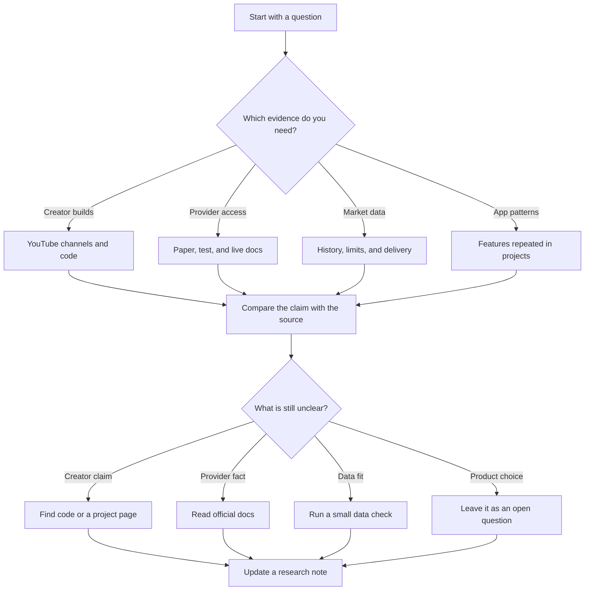

# Algorithmic trading research map

Status: research only
Purpose: find evidence, compare projects and providers, and record open questions. This map does not set product rules, requirements, or a build plan.

## Start here

Use the map to move from public hobby projects to provider documents, then to questions that still need evidence.



## Research index

| Question | Start with | What to pull out |
| --- | --- | --- |
| What do hobby builders make? | [Hobby algorithmic trading builds](research/hobby-algorithmic-trading-builds.md) | Channels, source code, providers, modes, and features shown. |
| Which providers appear in those builds? | [Hobby algorithmic trading builds](research/hobby-algorithmic-trading-builds.md) | Paper, test, and live paths, plus facts that need a current check. |
| How does market data scale? | [Massive rate limits and batching](research/massive-rate-limits-and-batching.md) | Request limits, pagination, batching, flat files, and evidence gaps. |
| Which sources cover options and events? | [Historical options and event data](research/credit-spreads/historical-options-and-event-data.md) | Contract history, quotes, trades, corporate events, earnings dates, cost, and licensing. |
| Which features repeat across projects? | [Hobby algorithmic trading builds](research/hobby-algorithmic-trading-builds.md) | Backtests, paper or dry-run modes, saved state, monitoring, alerts, and stop controls. |

## Research paths

### 1. Hobby projects

Start with the channel or creator table. For each example, separate four things:

- What the video claims
- What the source code or project page proves
- Which provider is named
- Whether paper, test, or live activity is actually shown

The report gives lower weight to a claim when there is no code, account view, order state, or fill record.

### 2. Providers

The current notes point to these provider paths. This table is a reading guide, not a provider decision.

| Provider | Appears in the research as | Paper or test path to check | Main open point |
| --- | --- | --- | --- |
| Alpaca | US stock builds | Separate paper host and credentials | Data coverage, paper fill limits, and current account access. |
| Interactive Brokers | Broader broker and asset examples | Paper account through TWS or IB Gateway | Session setup, reconnects, permissions, and paper differences. |
| Tradier | Equity and options examples | Sandbox host, token, and delayed data | Preview, multi-leg orders, rate limits, and partial fills. |
| OANDA | Foreign exchange examples | Practice host and account | Asset scope, account state, and practice versus production behavior. |
| Binance | Crypto examples and frameworks | Spot Testnet | Product, key permissions, rate limits, clock drift, and user-data streams. |

Read the official provider links in the research report before relying on a fact. Prices, limits, endpoints, and supported products can change.

### 3. Features

Across the examples, look for this observed chain:

```text
market data
  -> strategy or rule
  -> backtest
  -> paper, dry-run, or test activity
  -> intended order
  -> accepted, rejected, or filled result
  -> monitoring and saved records
```

This is a pattern found in the sources. It is not a product plan.

### 4. Data and evidence gaps

The data notes show that a provider name does not answer every research question. Check:

- Whether history includes delisted securities and changed contracts
- Whether timestamps mean event time, provider time, interval end, or file time
- Whether corrections and revisions can be reproduced
- Whether the data can be kept and used for the intended purpose
- Whether a paper or test fill behaves like a live fill

## Open questions

Keep these open until the sources answer them:

1. Which creator projects include enough code and records to reproduce the claimed workflow?
2. Which provider facts are confirmed by current official documents rather than old videos?
3. What does each paper or test environment fail to model?
4. Which features are common across projects, and which belong to one creator's setup?
5. What data, cost, and licence limits would change the research result?
6. Which claims need a small hands-on test before they can be trusted?

## Adding a finding

For each new note, record the claim, source link, date checked, evidence level, and what is still unknown. Keep a product decision separate from the evidence that led to it.

The repository keeps the research notes and this map. Product rules, implementation plans, and app code are not part of this research copy.
