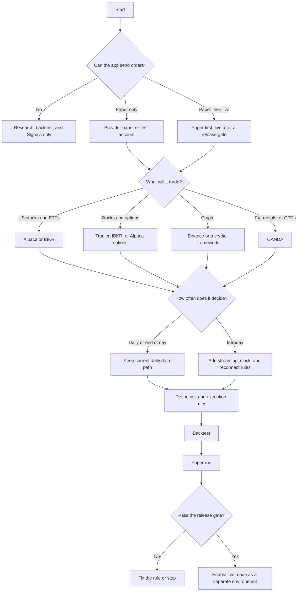

# Algorithmic trading app wayfinder

Status: decision map  
Purpose: choose the product rules before changing the current no-execution scope

## Start here

The repo currently does four things: stores market data, runs research and valuations, backtests Strategies, and shows Signals and Alerts. It does not connect to a broker or send an order. The new app request asks for paper trading and real trading, so the first decision is whether to change that boundary.



The suggested path is paper first, US stocks and ETFs, daily decisions, and Alpaca. That choice fits the existing repo and has the fewest new moving parts. It is a suggestion, not a settled requirement.

## Decision 1: what may the app do?

Choose one mode. Do not leave this vague.

| Choice | App behavior | What changes in this repo |
| --- | --- | --- |
| Research only | Backtest Strategies and show Signals. The Analyst places trades outside the app. | Keep `CORE-009` and `ALT-005`. This is the current product. |
| Paper trading | Send orders to a provider simulator or keep a local paper ledger. No real money. | Add provider accounts, order state, fills, and provider-specific limits. Keep live routing out. |
| Paper then live | Start with paper. Add live routing only after a stated release gate. | Replace the no-execution requirements with an explicit live mode, risk rules, credential rules, and failure handling. |

My suggested first release is paper trading. It lets the app test provider connections and order state without pretending that backtest results are live results.

## Decision 2: what will it trade?

| Choice | First provider paths found in the research | New work |
| --- | --- | --- |
| US stocks and ETFs | Alpaca or IBKR | Keep daily OHLCV first. Add buying power, positions, order state, and market hours. |
| Stocks and options | Tradier, IBKR, or Alpaca options | Choose the option data source, contract rules, multi-leg orders, and assignment behavior. |
| Crypto | Binance, Hummingbot, Freqtrade, or OctoBot | Add exchange symbols, 24/7 clock rules, user-data streams, and crypto-specific balances. |
| FX, metals, or CFDs | OANDA | Replace the US equity data model for the first live slice, or keep it as a separate asset path. |

The current repo already has US-listed equities and ETFs as its first coverage universe. Changing asset class before the first paper workflow will create a second product problem at the same time.

## Decision 3: what counts as a paper run?

There are two different things people call paper trading.

1. The app can simulate fills locally with stored data or a live quote stream.
2. A provider can accept API orders in a paper or test account.

Keep both names separate in the UI and in Run records. Store the fill rules, data source, fees, slippage, and provider environment for each one. Alpaca documents that paper fills do not model market impact, latency slippage, queue position, price improvement, regulatory fees, or dividends. IBKR also documents differences in paper order behavior. Paper is an integration test, not proof of live performance.

## Decision 4: which provider path?

### Alpaca

Use Alpaca when the first asset is US stocks and ETFs and you want a simple paper-to-live path. Paper and live use separate hosts and credentials. Alpaca supports market, limit, stop, stop-limit, trailing-stop, bracket, OCO, and OTO orders for supported equity cases. Its free data path has IEX coverage limits. Read the [authentication](https://docs.alpaca.markets/us/docs/authentication), [paper trading](https://docs.alpaca.markets/us/docs/paper-trading), [order](https://docs.alpaca.markets/us/v1.1/reference/postorder), and [market data](https://docs.alpaca.markets/us/docs/about-market-data-api) docs before selecting it.

### Interactive Brokers

Use IBKR when the app needs broad asset coverage or the broker's order and account features. A personal TWS API setup needs TWS or IB Gateway running, configured, and reconnected when it drops. Paper accounts use simulated execution. Read the [API overview](https://www.interactivebrokers.com/campus/ibkr-api-page/ibkr-api-home/) and [TWS setup guide](https://www.interactivebrokers.com/campus/trading-lessons/installing-configuring-tws-for-the-api/) before selecting it.

### Tradier

Use Tradier when options and advanced order shapes matter early. Its sandbox has delayed data and a separate token. It supports order preview and multi-leg order classes. Read [endpoints](https://docs.tradier.com/docs/endpoints), [trading](https://docs.tradier.com/docs/trading), and [rate limits](https://docs.tradier.com/docs/rate-limiting).

### Binance

Use Binance when the first asset is crypto. Spot Testnet uses virtual money and its own API environment. A framework's local paper simulator is a different thing. Read the [official API introduction](https://developers.binance.com/en/docs/introduction), [Spot REST rules](https://developers.binance.com/en/docs/products/spot/rest-api), and [testnet terms](https://developers.binance.com/en/docs/products/spot/testnet/TESTNET-TERMS-OF-USE).

### OANDA

Use OANDA when the first asset is FX, metals, or CFDs. OANDA documents separate practice and production hosts for its v20 API. Read the [development guide](https://developer.oanda.com/rest-live-v20/development-guide/) before selecting it.

## Decision 5: what must the app remember?

For every decision and every order attempt, record:

- Strategy revision and parameters
- provider and environment
- Security or contract
- data time and decision time
- intended target or order
- reason for the decision
- account buying power and current position snapshot
- provider response, order ID, fill IDs, fees, and rejection reason
- app version, data version, and paper assumptions

This extends the repo's existing Run manifest idea to provider activity. The provider's order ID is not enough by itself. The app also needs the Strategy decision that created it.

## Decision 6: what controls stop bad behavior?

Select values for these before any live release:

| Control | Example requirement to settle |
| --- | --- |
| Position size | Maximum cash or portfolio weight per Security |
| Number of positions | Maximum open positions |
| Loss limit | Stop new entries after a daily loss or drawdown |
| Exposure | Maximum gross and net exposure |
| Data freshness | Stop when the newest usable data is too old |
| Provider state | Stop when authentication, market data, order updates, or reconciliation is unhealthy |
| Duplicate orders | Same Strategy decision cannot submit twice |
| Restart | Reconcile the provider account before making a new decision |
| Manual stop | One visible control that stops new orders and records why |
| Market hours | Decide what happens before open, after close, during holidays, and during a provider outage |

The current project prefers fast local controls and no warning walls. That still allows a visible live-mode switch, a dry-run default, and one-click stop. It does not require typing a random confirmation phrase.

## Decision 7: what is the first usable workflow?

Use this as the first paper-trading acceptance test:

```text
import or download daily data
  -> inspect coverage and data age
  -> save a Strategy revision
  -> backtest with fees and slippage
  -> start one paper provider account
  -> calculate one eligible Signal
  -> create one intended order
  -> receive an accepted, rejected, or filled response
  -> save the provider state and app decision together
  -> restart the app
  -> reconcile state without duplicating the order
  -> show the result in the Run report
```

Do not add many Strategies, many providers, or intraday data before this workflow survives restart and provider failure tests.

## Requirement choices to settle

Fill one answer in each row. These are the decisions that should become changes to [`functional-requirements.md`](functional-requirements.md) after review.

| Question | Suggested first answer | Your answer |
| --- | --- | --- |
| Can the app send orders? | Paper only at first |  |
| First asset | US-listed equities and ETFs |  |
| First cadence | Daily, next eligible bar |  |
| First provider | Alpaca |  |
| Local simulation | Yes, with explicit fill assumptions |  |
| Provider paper account | Yes, as a separate mode |  |
| Live mode | Later release, off by default |  |
| Strategy code | External IDE, typed parameters in the app |  |
| Portfolio | One Security, long and flat for the first slice |  |
| Reports | Orders, fills, positions, P&L, costs, warnings, and manifest |  |
| Stop control | Stop new orders and keep the account state visible |  |
| Credential storage | Local environment file, never browser state |  |

Once these answers are chosen, update the accepted requirements and product design. Until then, keep live order code out of the current implementation so the repo does not contain two conflicting product definitions.

